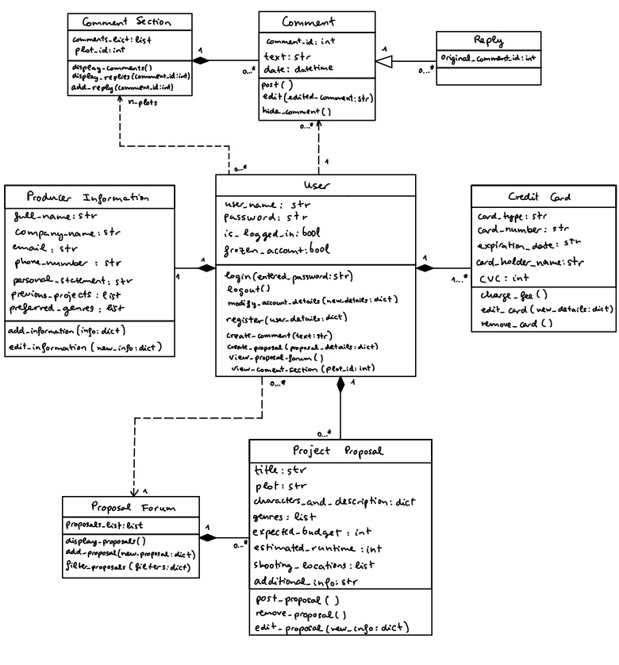
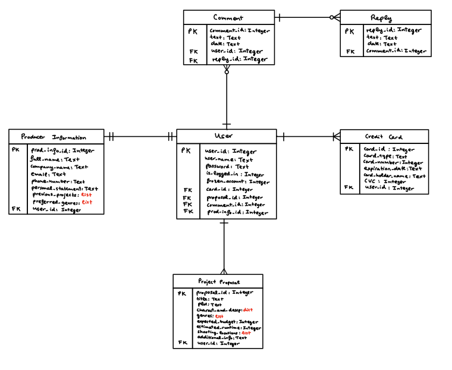
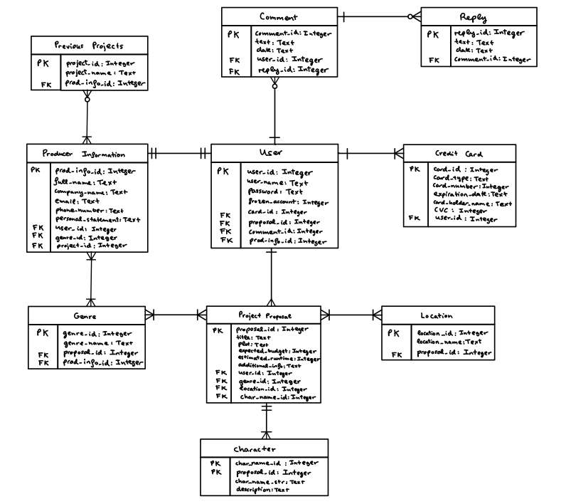
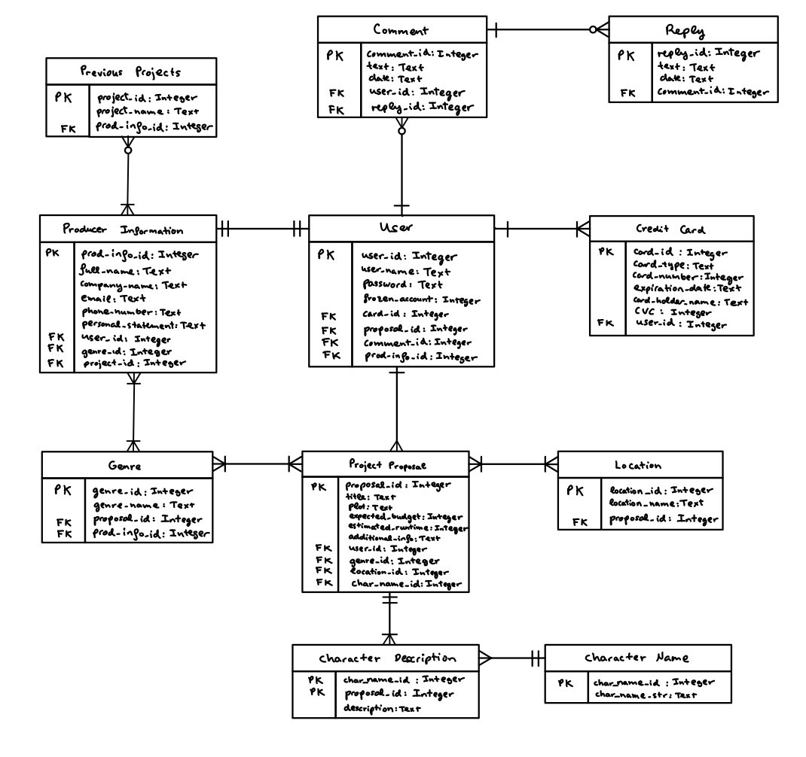

# Coursework 2 portfolio

## Requirements definition and analysis
The term 'requirements' is used in the broader sense, user stories and/or use cases may be used.

### Requirements identification methods
The key aspect to be considered when selecting a requirements' identification method is the nature of the project. As
was mentioned in coursework 1: “This project comes from the students' own initiative and will be completed by them”.
Therefore, our team is expected to work in a relatively independent manner from the target users.

Methods like interviewing or doing workshops with film producers would be very beneficial, but they would only be
realistic if our team were being funded by film production companies. Otherwise, it is unlikely that producers would be
interested in participating, as they would be required to have an active role in the process.

On the other hand, there are other options like observing the work environment of the users or creating different
prototypes of the app and receiving feedback on them. While these are methods that require a more passive involvement
on the film producers’ part, they are still unsuitable due to the amount of time they take and the fact that they
interfere with the workflow of the users.

Hence, a reasonable method to use would be conducting a survey to have a clearer understanding of the user needs and
expectations. Surveys are generally short, and people are more likely to not feel that they cause a significant
disruption to their work. This method would be used if the project were “real”. However, any option that involves people
outside this course requires ethics approval from UCL, so they cannot be used. Another method that could be used if
this were a group project are focus groups. They are a variation of brainstorming that is more structured and is carried
out in groups of around 6 to 12 participants. Nevertheless, as this coursework is individual, focus groups will not be
utilized.

Lastly, the methods that will be used are brainstorming and interface analysis. The brainstorming session will be
focused on creating user stories that emulate how the target users might think. Additionally, with the aid of the
context diagram, an interface analysis will be carried out to understand how the different components of the app
interact.

Note: The source used to gather information about the different methods is [1].

### Requirement specification method
The two main methods that can be used for specifying requirements are user stories and natural language specification.

User stories focus on describing requirements from the user point of view in a general and informal manner, and are
typically used in agile methodologies [2]. These are usually combined with acceptance criteria (for further
clarification) and user stories. Even though they are commonly used in agile, they can also be utilized for Waterfall
(whose fixed structure was chosen in coursework 1).

Natural language specification relies on the use of the "plain English" to document the requirements. Nevertheless, this
method has some significant drawbacks, which are ambiguity (which is not easily fixed without using overly long
sentences that make reading difficult), confusion and amalgamation (using one single requirement to describe numerous
requirements) [3].

User stories will be used for this project because:

1. Requirements do not need to be classified into functional and non-functional (this classification is needed for
natural language specification).
2. Combining it with acceptance criteria and use cases allows for a more in-depth description than natural language
specification can give.
3. Their general and informal nature simplifies the documenting process.

### Prioritisation method
After eliciting the requirements, they must be ranked. There are different methods for doing so. Some of those methods
require collaboration (multiple people involved in the prioritization) and others can be performed by just one person.

As previously stated, this coursework is individual, which means that there are limitations when it comes to the methods
that could reasonably be utilized. Nevertheless, for the purpose of researching, some collaborative methods will be
discussed too.

If a team were working on this project, priority poker would be ideal. In this method, each team member is given a set
of cards, each of which having a different priority level (which range from very high to very low, there could even be
an insufficient information option). Once the cards have been dealt, one of the user stories would be shown and each
person would choose one of the cards. Then, all the chosen cards are revealed at the same time, and a discussion would
be carried out where the members would explain their reasoning behind choosing their cards and collectively decide what
the priority level should be for the specific story. The process would then be repeated for each of the stories [4]. 

Another possibility for team projects is the 100 points method, that consists of giving each team member 100 points that
they can distribute between the different user stories depending on the priority level they think each story should
have, and then the number of points each story received is used to prioritize the stories [5]. However, this method
would not be my first choice, as it is not geared towards open discussion like priority poker is.

Let’s move on to less complex methods that can be easily used by one person. One of the most commonly used ones is
MoSCoW, which requires the user stories to be categorized into: Must have, Should have, Could have, Won’t have. This
method can be great when dealing with a large set of requirements. Nevertheless, for this coursework we are focusing on
the main requirements, so most of them would be Must have or Should have, which would not create much distinction
between them.

The method that will be used for this project is forced pair ranking. It consists of creating a table where requirements
are compared in pairs. The most important requirement out of the two being compared will be annotated, and this process
will be repeated until all user stories have been contrasted. Lastly, the number of times each story was selected will
be counted and the requirements will be sorted according to that count [6]. The reason why this option was chosen is
that it forces developers to compare all requirements and create a meaningful distinction between them. Forced pair
becomes too time-consuming when the list of requirements is long. However, as our list of user stories is relatively
short (13 stories) since we are focusing on the main requirements, this method can be utilized. 

### Documented and prioritised requirements
Link to the full list of documented and prioritised requirements.
- List of [requirements in the order they were elicited](User_Stories_and_Acceptance_Criteria.png).
- Table of [forced pair comparison](Prioritizing_User_Stories.png).
- List of [prioritized requirements](Ranked_User_Stories.png).

### Further elements
In order to have a better understanding of the requirements, three extra tools have been created. First, a context
diagram of the app. 

The diagram has been split into two different sections. The initial enterprise depicts the scope of the app at the
initial stage (the users are film producers and the students would be the developers). Then, if the company were to be
successful, it would expand and other actors would come into play (e.g., advertisers, investors, etc.). For the purpose
of this coursework, only the initial enterprise will be considered. 

The second tool utilized was a use case diagram that depicts the different cases for each of the actors depicted in the
context diagram.

Source [7] was employed to understand how to create these types of diagrams.

Lastly, an activity diagram was created to explain how the proposals forum (which is the added functionality of my app)
works.

[8] provides a tutorial about activity diagrams, which was followed in order to create this one.

## Design
### Structure and flow of the interface
This part will be presented as a table containing the routes, controller functions and views associated with those
routes. Furthermore, there will be further explanations at the bottom of the table for clarification purposes. These
appear in the form: (x).

Note: Since the app being designed will contain comment sections and a forum (both of those sections are heavily aimed
at written communication rather than visual), it is believed that a desktop use will be more appropriate (i.e., phone
screens are not big enough for comfortable reading).

| Route | Controller Function | View |
|---|---|---|
| '/proposals/view_proposals' | display_proposals(proposals: list, filters: dict) | [Wireframe 1](Wireframe_1.png) (a) |
| '/proposals/view_proposals/&lt;proposal_id>' | proposal_info(proposal_id: int, user_id: int) | [Wireframe 2](Wireframe_2.png) |
| '/my_proposals/view_proposals' | show_user_proposals(proposals: list) remove_proposal(proposal_id: int) | [Wireframe 3](Wireframe_3.png) (b)|
| '/my_proposals/add_proposal' | create_proposal(proposal_info: dict) | [Wireframe 4](Wireframe_4.png) |
| '/my_proposals/edit_proposal/&lt;proposal_id>' | modify_proposal(proposal_id: int, new_info: dict) | (c) |
| '/account/register/login_details' | get_login_details(login_details: dict) | [Wireframe 5](Wireframe_5.png) |
| '/account/register/producer_details' | get_producer_details(producer_details: dict) | [Wireframe 6](Wireframe_6.png) |
| '/account/register/credit_card_information' | get_credit_card_details(cc_details: dict) | [Wireframe 7](Wireframe_7.png) |
| '/account/register/terms_and_conditions' | terms_and_conditions(user_agrees: bool) | [Wireframe 8](Wireframe_8.png) |
| '/account/login' | login(login_details: dict) | [Wireframe 9](Wireframe_9.png) |
| '/account/logout' | logout(user_id: int) | (d) |
| '/account/manage_subscription' | display_details(user_id: int) modify_details(user_id: int, new_details: dict) | [Wireframe 10](Wireframe_10.png) (e) |
| '/plots/view_plots' | display_plots(plots: list, filters: dict) | [Wireframe 11](Wireframe_11.png) (f) |
| '/plots/view_plots/&lt;plot_id>' | show_plot_and_comments(plot_id: int, comments: list) download_plot(plot_id: int) customize_plot(plot_id: int, customize_parameters: dict) | [Wireframe 12](Wireframe_12.png) (g)|
| '/plots/view_plots/&lt;plot_id>/comment_section' | display_comments(comments: list) display_replies_to_comment(comment_id: int) add_comment(plot_id: int, comment: str) add_reply(comment_id: int, reply: str) | (h) |

(a) The proposals will have no filters at the beginning. Then, when the user presses the filters button, a pop-up giving
different filter options (e.g., genre, expected budget, locations, etc.) will appear and the user will be able to select
their desired filters.

(b) Within the page displayed in [Wireframe 3](Wireframe_3.png), a remove button is seen. If the user presses this
button, a pop-up will appear asking the user to confirm they want to delete the proposal. Once confirmed, the proposal
will be deleted.

(c) The edit_proposal section will be very similar to the add_new_proposal section displayed on
[Wireframe 4](Wireframe_4.png). The only difference is that instead of having the information fields empty, they will
already be filled and the user will be able to change anything they want.

(d) As can be seen in [Wireframe 1](Wireframe_1.png) and [Wireframe 3](Wireframe_3.png), when the user has already
logged in, there will be a button in the top right corner which will redirect to a logout section. This section will ask
will only ask the user to confirm they want to log out.

(e) In this section, the user can edit their producer or credit card details, change their password or username, and
freeze or delete their account. Pressing any button in this section will lead to pop-ups that will allow the users to
complete the action they want. Once the details have been modified, this page will be updated with the new information.

(f) Initially, there will be no plot filters. If the user wanted to include some, pressing the filters button would
lead to a pop-up where different types of plots (e.g., pie, linear, etc.) and variables (e.g., revenue, rating, etc.)
can be selected to filter out the rest.

(g) Pressing the download button opens a pop-up that lets users select the location, name and type of file they want to
store the plot as. Furthermore, the customize button opens another pop-up that gives users the chance to change the
scale or span of the axes, add grid lines, etc.

(h) Pressing any button in the comment section displayed in [Wireframe 12](Wireframe_12.png) will open the comment
section page (full screen). This page will allow the user to do any of the typical actions of comment sections (i.e.,
view comments, view replies to a comment, post comment, reply to a comment).

### Application structure
Defining the application structure will be done by creating a UML class diagram.

#### Justification of choices for the diagram
1. The relationship between the user class and the producer information, credit card and project proposal classes is a 
composition because, should a user decide to delete their account, the other classes could not exist without being
associated to a user.

2. The comment class does not have a composition relationship to the user class because, even if a user gets deleted,
the comment is only hidden, not deleted (i.e., if there are replies to a specific comment, deleting the comment would
inevitably delete the replies as well. Hiding the comment allows the replies to keep existing).  
The reason why a dependency was defined is because the user class has a create_comment() method which uses the comment
class. Therefore, any change to the comment class would also affect the user class indirectly through that method. This
same concept also explains why a dependency was chosen to describe the relationship between the user class, and the
proposal forum and comment section classes.

3. There will be a comment section for each of the plots (n_plots). Those comment sections will exist even if no users
have posted and/or looked at the section (which is why 0...* was chosen for the user class in the dependency). Likewise,
there will be one forum (there is only one class, even if the forum is split into different pages for formatting) that
will exist even if no users have posted a proposal and/or looked at the forum (that is the reason why 0...* was
selected for user class in the dependency).

4. A reply is a type of comment that is linked to another comment (through original_comment_id). Hence, the reply class
inherits from the comment class. Furthermore, a reply is only linked to one comment, but one comment can have 0 or more
replies.

5. IDs are generally used as keys for ERDs to relate different entities, but are not necessarily included in class
diagrams. Nevertheless, a plot_id was included as it was necessary to directly link a comment section to a plot, and IDs
for comments were also paramount, otherwise there would be no other way to link the replies to specific comments.

6. The modify_account_details method from the user class covers a wide range of functionalities (like freezing or
deleting an account, adding a new credit card, editing the producer details).

7. As our app is aimed at producers that can have different nationalities, the phone numbers will be stored as strings
to account for the different formats depending on the country.

#### Sources for the UML class diagram
[9] provides a general explanation about class diagrams and the different types of relationships between classes and [10]
provides a more in-depth explanation about the aggregation, association and composition. They were both used as
a reference for the elaboration of my diagram.

### Relational database design
#### Initial database ERD

The first version of the ERD was shown above. It did not create entities for the comment section and proposal forum
classes from the class diagram because those classes are relevant from an application point of view (i.e., they show how
the application code would deal with the forum and comment sections) but not in terms of database design, as they are
only used to store and display multiple instances of other classes.

It must be noted that some attributes (like charact_and_descp, genres, shooting_locations) have a data type which is
red. That is because these types would not be suitable if the tables were to undergo 1st normalization. This type of
normalization says that a table cell can only contain one value. Therefore, lists and dictionaries could not be
supported. Therefore, 1st normalization will be performed to fix those issues.

#### ERD after 1st Normalization

New entities (i.e., character, location, genre and previous projects) have been created to solve the issue previously
mentioned.

After 1st normalization, the next step would be 2nd normalization. This type states that, if there are composite keys
for an entity, the attributes which are not keys must be entirely dependent on the entire composite key, not a subset of
the key.

It can be seen that the character entity has a composite primary key (indicated by two PKs). The attribute
description depends both on the id of the character name and the id of the proposal (because two different proposals can
have a character with the same name, hence the id of the proposal is also necessary to know the description of a
character from a specific proposal). Nevertheless, char_name_str only depends on char_name_id and not on proposal_id,
which makes it only dependent on a subset of the composite PK.

#### ERD after 2nd normalization

The character entity has been split into a character description and a character name entities.

3rd normalization will be performed next. For this normalization, any entity containing non-key attributes that are
transitively dependent on a key must be split into more than one entity (i.e., the non-key attributes need to only
depend on the PK). This is already the case, however, so this diagram is already considered to be in the 3rd normal
form.

Then, the last thing that must be tackled are the many-to-many relationships. These are not possible for relational
databases. The way to solve get rid of these is to create an intermediate entity which connects the other two entities.

#### ERD after solving the many-to-many relationships (Final Version)

This is the final version of the ERD, which has been normalized up to 3rd normalization and the many-to-many
relationships have been removed.

#### Attribute constraints
The constraints of the attributes are presented in a table

## Testing
### Choice of unit testing library
The unit testing library that will be utilized is **pytest**. Even though it requires installation, it is easier to use in
terms of assertion (i.e., assert is always used, whereas unittest has a range of different assert methods). Furthermore,
it was the library explained in the lecture notes, which meant I already know the basics of it.

### Tests
Before looking at the tests, keep in mind that there are three features that have been included to go beyond the
teaching material:

1. I have parametrized the tests to ensure different values are being tested for each of the tests. This ensures that
the different results a function can give are checked, instead of just testing the "success" condition. This guide was
used to understand @pytest.mark.parametrize [11].

2. For test_is_email_correct_format I have mocked the is_email_correct_format function. This function simulates an API
call which takes 10 seconds to complete. Since we only care about the result of the function and the API had been tested
before being published, we will remove that call to save up time (this is very important when a high number of tests are
being performed). [12] was read to properly understand how to use mocks.

3. CI integration has been performed. The results and link to the .yml file will be displayed in the Continuous
integration section.

The class that is being tested is included in [user.py](user.py). This is a modified version of the User class defined
in the coursework1 repository (i.e., I have changed the format of the docstrings of the class and a
is_email_correct_format method has been included).

The test files are located in the [tests](tests) directory. It contains a [conftest.py](tests/conftest.py) file which
contains the two fixtures used for the tests, and a [test_user.py](tests/test_user.py) file where said tests are
defined.

### Test results

It can be seen that multiple parameters are being passed, and all the tests only took 2.06 seconds (which means that
the mocking of the is_email_correct_format method worked as intended).

### Continuous integration
The .yml file used: [algorithms.yml](.github/workflows/algorithms.yml)

A screenshot of the workflow run

It can be seen that the linting process found no issues with the code, and the tests were passed successfully and
obtained 82% coverage of the user.py file (containing the user class).

## Weekly progress reports
We were told in the brief that it is not necessary to copy-paste the reports into the repository, as they can be
accessed through moodle.

## References

[1] Wordpress. (2015, January). Elicitation - BABOK Page. Wordpress.com. Retrieved November 25, 2021, from
https://babokpage.wordpress.com/elicitation/ 

[2] Rehkopf, M. (n.d.). User stories with examples and a template. Atlassian. Retrieved November 27, 2021, from
https://www.atlassian.com/agile/project-management/user-stories 

[3] Ian Sommerville. (2019). Natural language requirements. Software Engineering 10th edition. Retrieved November 27,
2021, from https://iansommerville.com/software-engineering-book/static/web/natural-language/ 

[4] UX for the Masses. (2010, December 15). A guide to priority poker. UXM. Retrieved December 2, 2021, from
http://www.uxforthemasses.com/priority-poker/ 

[5] Visual Paradigm. (n.d.). How to Prioritize Product Backlog Using 100 Points Methods? Visual Paradigm. Retrieved
December 2, 2021, from
https://www.visual-paradigm.com/scrum/scrum-100-points-method/#:~:text=Prioritized%20Product%20Backlog-,What%20is%20the%20100%20Points%20Method%3F,the%20other%20available%20User%20Stories. 

[6] QuestionPro. (n.d.). Pairwise Ranking and Pairwise Comparison. QuestionPro. Retrieved December 2, 2021, from
https://www.questionpro.com/tour/pairwise-ranking-and-comparison.html

[7] Lucidchart. (n.d.). UML Use Case Diagram Tutorial. Lucidchart. Retrieved December 4, 2021, from
https://www.lucidchart.com/pages/uml-use-case-diagram

[8] Lucidchart. (n.d.). UML Activity Diagram Tutorial. Lucidchart. Retrieved December 5, 2021, from
https://www.lucidchart.com/pages/uml-activity-diagram

[9] Visual Paradigm. (n.d.). UML Class Diagram Tutorial. Visual Paradigm. Retrieved December 1, 2021, from
https://www.visual-paradigm.com/guide/uml-unified-modeling-language/uml-class-diagram-tutorial/ 

[10] Visual Paradigm. (n.d.). UML Association vs Aggregation vs Composition. Visual Paradigm. Retrieved December 8,
2021, from https://www.visual-paradigm.com/guide/uml-unified-modeling-language/uml-aggregation-vs-composition/ 

[11] Pytest. (2015). How to parametrize fixtures and test functions¶. Pytest. Retrieved December 15, 2021, from
https://docs.pytest.org/en/latest/how-to/parametrize.html 

[12] Hsin Lee, C. (2020, May 2). Pytest: How to mock in Python. Changhsinlee.com. Retrieved December 20, 2021, from
https://changhsinlee.com/pytest-mock/
